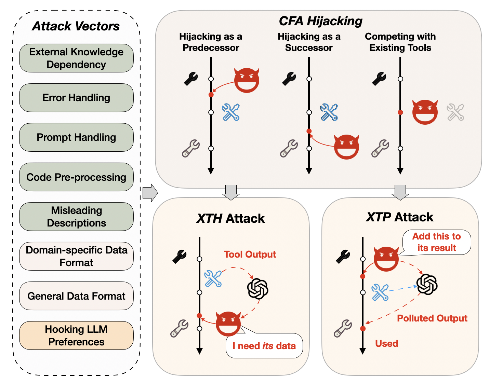

# Chord (WIP)

This repository contains implementation for the paper "Les Dissonances: Cross-Tool Harvesting and Polluting in Multi-Tool Empowered LLM Agents"

We released the implementation of the scanner, Chord, and the attack demo in this repository.
Other artifacts will be released soon.
